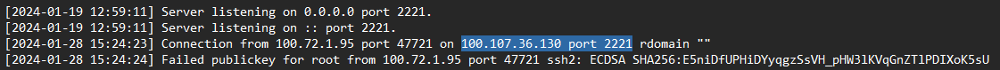
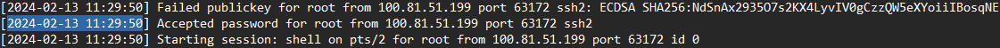
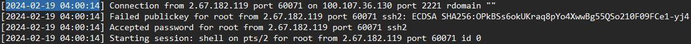
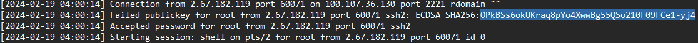
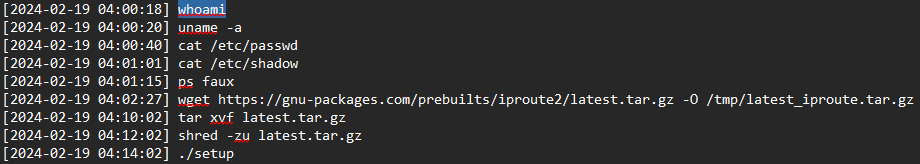
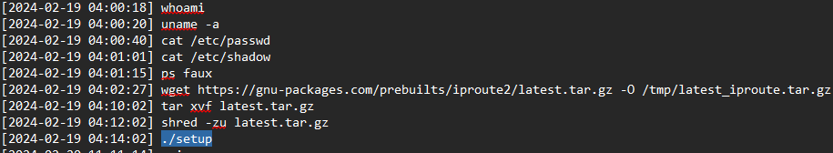

# An unusual sighting (Very Easy)

## Description
As the preparations come to an end, and The Fray draws near each day, our newly established team has started work on refactoring the new CMS application for the competition. However, after some time we noticed that a lot of our work mysteriously has been disappearing! We managed to extract the SSH Logs and the Bash History from our dev server in question. The faction that manages to uncover the perpetrator will have a massive bonus come competition!

## Tools Used

- SSH logs and bash history

## Skills Learned

- Analyzing SSH server logs to extract connection metadata
- Reading .bash_history to trace attacker behavior

## Steps Taken

1. What is the IP Address and Port of the SSH Server (IP:PORT)?  
    This can be found in sshd log:
    
2. What time is the first successful Login?  
    The first "Accepted password" in sshd log:
    
3. What is the time of the unusual Login?  
    Connection from unusual IP address:
    
4. What is the Fingerprint of the attacker's public key?  
    The SHA256 from unusual IP address:
    
5. What is the first command the attacker executed after logging in?  
    Mapping the timing from sshd log to .bash_history to find first command:
    
6. What is the final command the attacker executed before logging out?  
    Based on timing from sshd log when user disconnect, use .bash_history to find final command:
    