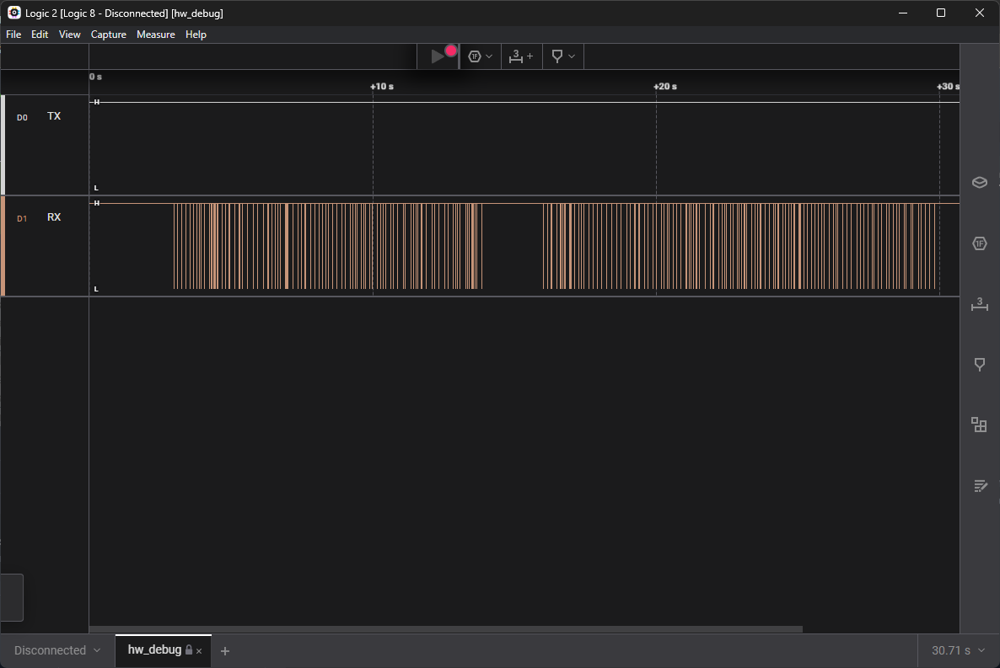
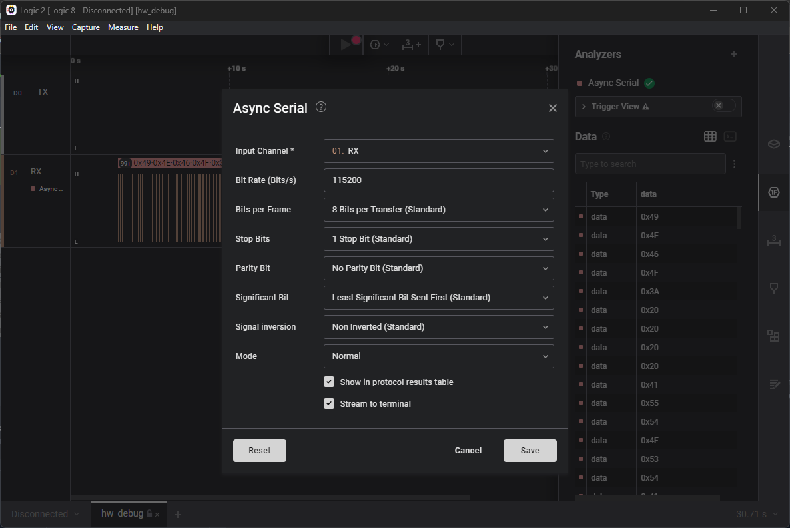
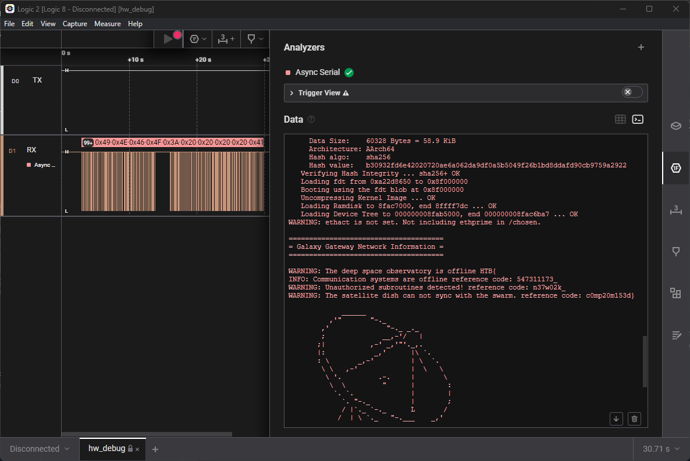

# Bebug (Easy)

## Description

Your team has recovered a satellite dish that was used for transmitting the location of the relic, but it seems to be malfunctioning. There seems to be some interference affecting its connection to the satellite system, but there are no indications of what it could be. Perhaps the debugging interface could provide some insight, but they are unable to decode the serial signal captured during the device's booting sequence. Can you help to decode the signal and find the source of the interference?

## Tools Used

- Logic 2

## Skills Learned

- Analyzing signal

## Steps Taken
1. Open signal file using Logic 2

2. Using Analyzer -> Async Serial and inputting the correct params (common bit rate of satellite dish is 115200 bits/s)

3. View the output data in terminal and find the flag
