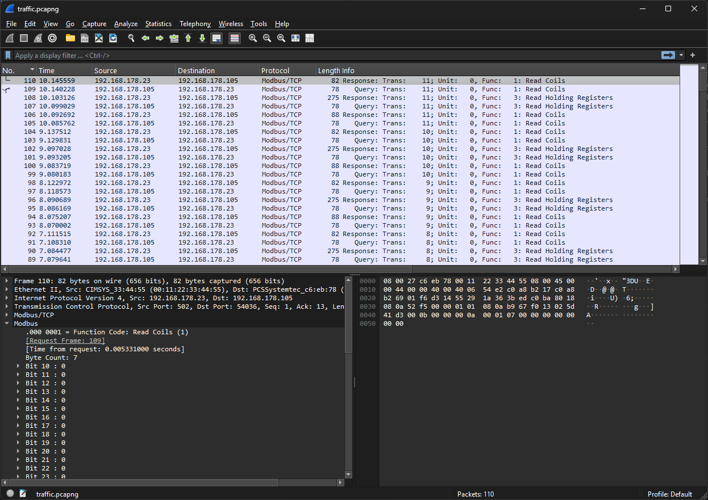
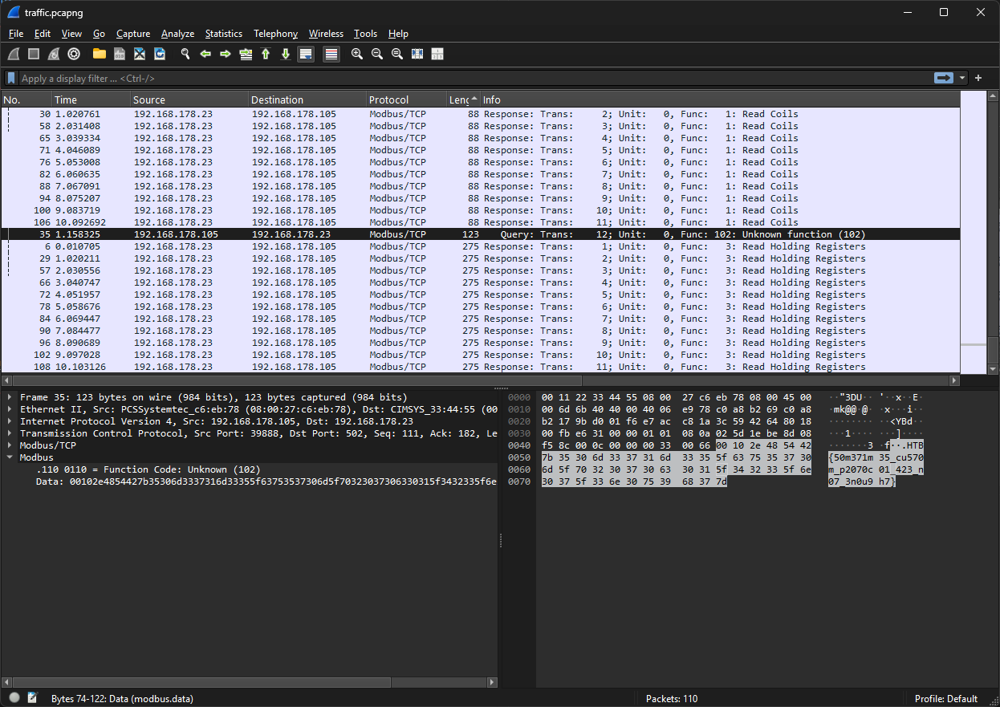

# Shush Protocol (Very Easy)

## Description

The crew sets their sights on an abandoned fertilizer plant, a desolate structure rumored to hold a cache of ammonium nitrate—crucial for their makeshift explosives. Navigating through the plant’s crumbling corridors, they reach the main control room where a dusty, outdated PLC still hums faintly with power. The crew's hackers spring into action, connecting their equipment to the network of the PLC and starting the process of extracting data. They know that finding the password the control device uses to connect to the PLC is key to gaining full access to it. The hackers deploy network enumeration tools to scan for active devices on the plant's internal network. They meticulously sift through IP addresses, looking for clues that might reveal the password. After several tense hours, they pinpoint the device—a ruggedized industrial computer buried under layers of dust, still linked to the PLC that performs certain diagnostic operations under a custom protocol on a specific interval. Having captured the traffic from that connection the only thing that remains is to locate the packet that contains the secret information.

## Tools Used

- Wireshark

## Skills Learned

- Examining packets

## Steps Taken
1. Open traffic.pcapng using Wireshark

2. Sort by length and find packets with an unknown function (102)
3. Found packet with a lot of data.
4. Get flag by viewing data in ASCII
